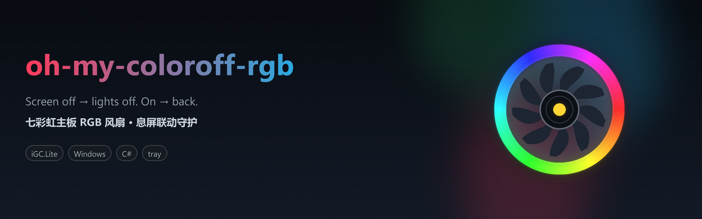

<p align="center">
  
</p>
<p align="center">
  English | <a href="README.md">简体中文</a>
</p>

**Screen off → lights off. Screen on → lights back.**

Leaving the PC running overnight for downloads is fine; the RGB fans lighting up your
bedroom are not. This Windows tray daemon ties your Colorful (七彩虹) motherboard's RGB
fans to the display power state: screen off → lights off; screen on → your saved effect
is restored.

## Quick start (30 seconds)

Requires Windows 10/11, a **Colorful motherboard**, and **[iGC.Lite](https://www.colorful.cn) installed**.

**1. Download** [`oh-my-coloroff-rgb-win-x64.zip`](../../releases) (latest release) and
extract it anywhere.

**2. Install**: in the extracted folder, right-click empty space → **Open in Terminal**
(Windows 10: Shift+right-click → *Open PowerShell window here*), then paste and run:

```powershell
powershell -ExecutionPolicy Bypass -File scripts\setup_autostart.ps1
```

That's autostart at boot, plus auto-relaunch if the daemon ever dies.

**3. Start it**: double-click `bin\RgbAuto.exe` — a yellow dot in the tray means success
(skippable; it starts at next boot anyway).

> Just looking? Grab the bare `RgbAuto.exe` and run it — no install, no autostart.
> Uninstall: run `scripts\remove_autostart.ps1`, then delete the folder.

## Features

- **Display-driven**: idle timeout, hotkey, `SC_MONITORPOWER` — every kind of screen-off counts.
- **Debounced**: lights go off only after the display has been stably off for 1.5 s and
  back after 1.0 s on; fake power events caused by LED writes are filtered, so the
  lights never flicker back and forth.
- **System tray**: yellow dot = lights on, gray = off; right-click for
  *Restore effect / Lights off / Exit* (Exit also stops the auto-relaunch).
- **Plays nice with iGC.Lite**: open Lite to tune effects — the daemon steps aside and
  takes over again within seconds after Lite closes.
- **Self-healing**: a scheduled task checks every 5 minutes and relaunches the daemon
  if it died; the log rotates at 1 MB.
- **Multi-device**: the sleep effect is pushed to every lighting device found
  (motherboard, and any future Colorful GPU).

## Usage

- Daily driving: forget it exists. Tune effects by opening iGC.Lite, then close Lite.
- Tray *Restore effect* / *Lights off* take effect immediately and stick until the next
  display change.
- Tray **Exit** = stop for real (no auto-relaunch afterwards; the autostart task stays —
  re-run the setup script to re-enable, `scripts\remove_autostart.ps1` to uninstall fully).
- `tools\turn-off-display.cmd`: manual screen-off helper for testing without waiting
  for the idle timeout.

## How it works

1. Listens for Windows' `GUID_CONSOLE_DISPLAY_STATE` power events (Windows replays the
   current state at registration, so startup always has the right state).
2. A debounce timer checks every 500 ms: once the display is stably off, push
   `SetLightingEffect(id, Sleep)` to every device; once stably on, call
   `InitLightingEffect()` to restore the saved effect.
3. LED control goes through iGC.Lite's own service component (`LEDAPIService`,
   read-only), used exactly the way the vendor's own UI uses it.

## Limitations

- Colorful-only: their lighting is only controllable through the vendor's iGC.Lite
  (OpenRGB doesn't support these boards), and this daemon borrows that private stack —
  a vendor update can break it.
- Covers display sleep, not system sleep/hibernate (fans may freeze mid-glow).
- Verified on one board (BATTLE-AX B760M-WHITE WIFI D5); other Colorful models may
  enumerate differently.

## Build from source

<details>
<summary>No IDE needed — one csc command (click to expand)</summary>

```bat
csc -nologo -platform:x64 -target:winexe -win32icon:assets/app.ico -out:bin\RgbAuto.exe ^
  "-r:C:\Program Files\iGC.Lite\iGameAPI.Contracts.dll" "-r:C:\Program Files\iGC.Lite\iGC.Lite.Service.dll" ^
  "-r:C:\Program Files\iGC.Lite\iGameCenter.ConfigManager.dll" "-r:C:\Program Files\iGC.Lite\Castle.Core.dll" ^
  "-r:C:\Program Files\iGC.Lite\iGameCenter.Hardware.dll" "-r:C:\Program Files\iGC.Lite\iGameCenter.Contracts.dll" ^
  -r:System.dll -r:System.Windows.Forms.dll -r:System.Drawing.dll src\RgbAuto.cs
```

</details>

## For agents & contributors

Empirical hardware findings, architecture invariants, and vendor-stack caveats live in
[AGENTS.md](AGENTS.md) — read it before modifying the code.

## Disclaimer

A non-commercial personal project written for the author's own motherboard, mostly
AI-assisted (vibe coding), shared for learning and exchange only. Not affiliated with
or endorsed by Colorful; "Colorful", "iGC.Lite" and related marks belong to their
respective owners and are mentioned here only to describe compatibility.

iGC.Lite's components are called read-only — nothing of the vendor's stack is modified
or redistributed. This usage stays within iGC.Lite's own bundled License.txt, which
permits free personal installation and use and prohibits only reverse engineering /
decompilation and commercial use — none of which this project involves. If anything
here infringes your rights, please open an issue; it will be dealt with promptly, up to
taking the project down.

## License

MIT — see [LICENSE](LICENSE).
